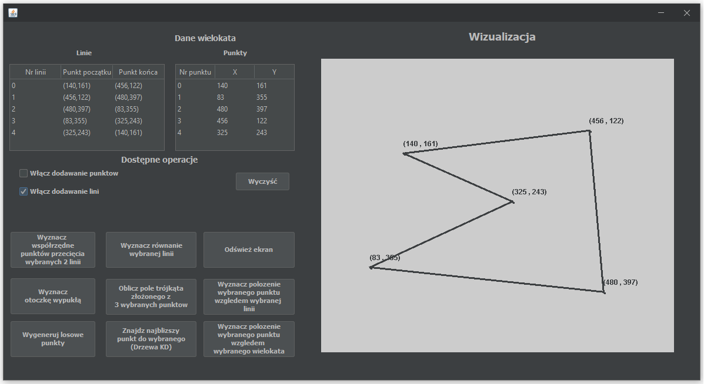

# Computational-Geometry-Helper
An Application which was a project for one of the subjects realized during the studies - computational geometry. 

## Table of contents
* [General info](#general-info)
* [Screenshots](#screenshots)
* [Technologies](#technologies)
* [Features](#features)
* [Status](#status)

## General info
An Application which was a project for one of the subjects realized during the studies - computational geometry. 
It contains a set of geometric algorithms based on 2D planes, such as determining the convex hull with the Jarvis algorithm.
Moreover it contains algorithm for finding the closest point based on KD Tree. Additionally, all perfomed operations are visualized
in real time on 2D space, which is a Cartesian system.
>

## Main panel appearance

## Technologies
* Java
* Swing

## Features
List of working features:
* Based on KD Trees 
* Jarvis algorithm for determining the convex hull
* Adding points by clicking on the visualization area
* Adding lines by clicking on two selected points existing in the visualization area
* Generating a point cloud with random coordinates (x, y) 
* Table with coordinates of points - updated in real time 
* Table with lines - updated in real time 
* Determining the coordinates of the point of intersection (if any) of two lines 
* Determination of the equation of the line 
* Determining the position of the selected point from the table of points in relation to the line selected from the table of lines
* Determining the position of a point entered by the user (in a new window), in relation to a polygon created on the basis of points selected from the table of points
* Calculation of the area of a triangle composed of 3 selected points 

## Status
The project will not be developed due to outdated technology. However, a new version based on Java FX is planned.

## Appearance of application
* [ConvexHull Algorithm](./images/Convex-Hull.png)
* [The closest neighbor - KD Tree](./images/KD-Tree.png)
